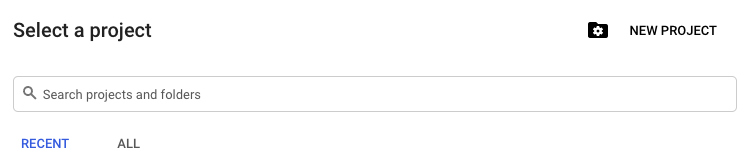
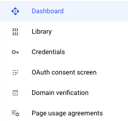
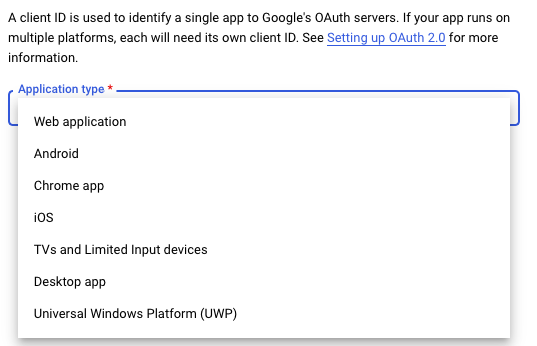
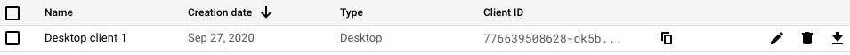
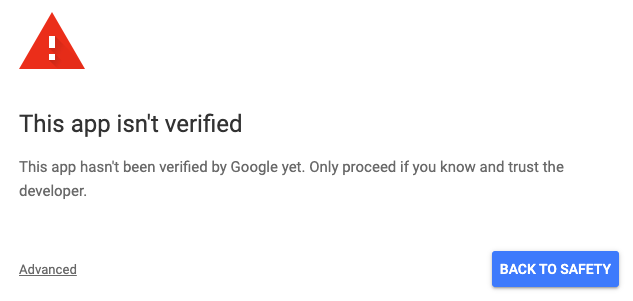

<h1>GoogleAPI-Fun</h1>
Some samples using the Google API to do epic stuff.

<h3>What is the Google API?</h3>
The Google API allows you to interact with Google services through code. This lets you automate actions or display information. There are endless uses for these. You can display your youtube channel's stats on a wall, or automatically spam your friends at 1:00 am. <a href="https://console.developers.google.com/apis/library?project=pelagic-tracker-290623&folder&organizationId">Here</a> you can view the available APIs from Google. Many more APIs will come to this repository soon.

<h3>Setup</h3>
You must have a google account and pip installed.   
Start by heading to the <a href="https://console.developers.google.com">developer console</a> and click <kbd>Select a project</kbd> on the top right of the page.

Click <kbd>New Project</kbd> and name it. Hit <kbd>CREATE</kbd>.  
Now your project is created, but we have to add the APIs we want to use. Click <kbd>Library</kbd> on the left of the page.

Add the APIs you will use. 

<h3>Authorization</h3>
The Google API uses OAuth to authorize access to project. This can be a painful proccess without guidance, because the official docs are pretty lousy. 
Click <kbd>Credentials</kbd> on the left of the page on your developer console and click <kbd>CREATE CREDENTIALS</kbd>. Select <kbd>OAuth Client ID</kbd> and select <kbd>Desktop app</kbd> as your application type.

Name your credentials and hit <kbd>create</kbd>.  Now download the credentials' json file and move it to to your cloned repository.  

You will also need to authorize acess to your google account. For the Youtube API, you instructed to visit a link where you authorize access. If you get the following screen: 

Click <kbd>Advanced</kbd> and <kbd>Go to {project name}</kbd> You should recieve a code, which you paste into your shell. 
If you are using any of the other APIs, you will automatically be directed to a localhost, where you sign in to your account.

<h3>To-do</h3>
At the moment, only a few APIs are used in this repository, but many more are coming.

<h3>Feedback and Contributions</h3>
If you have any suggestions, questions, or bugs, please open an issue. If you want any code changes, please open a pull request. Feedback is greatly appreciated.

